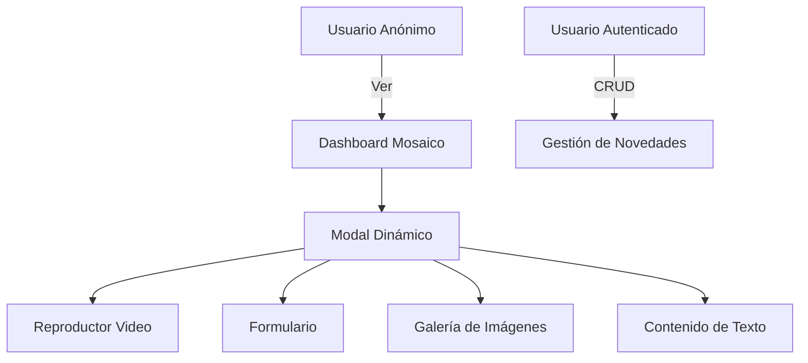
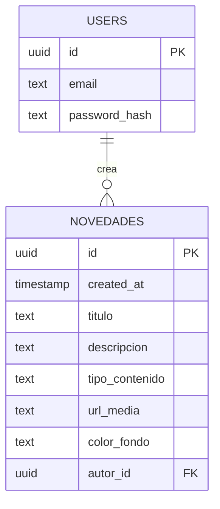

# Especificación de Requerimientos de Software (SRS)
## Aplicación de Cartelera de Novedades - SGI Sector

**Versión:** 1.0  
**Fecha:** 03 de Febrero de 2026  
**Autor:** Gerardo Gallardo  

---

## 1. Introducción

### 1.1 Propósito
Este documento describe los requerimientos funcionales y no funcionales para el desarrollo de una **Aplicación de Cartelera de Novedades**, un sistema digital que permite la gestión y visualización de información importante en formato de mosaico interactivo.

### 1.2 Alcance
La aplicación será una plataforma web moderna que permitirá:
- Publicar novedades en diferentes formatos (texto, video, formularios, galerías)
- Visualizar contenido en un dashboard tipo mosaico responsivo
- Gestionar usuarios y permisos de publicación
- Almacenar y gestionar archivos multimedia

### 1.3 Definiciones y Acrónimos
| Término | Definición |
|---------|------------|
| **SRS** | Software Requirements Specification |
| **RLS** | Row Level Security (Seguridad a nivel de fila) |
| **CRUD** | Create, Read, Update, Delete |
| **UI/UX** | User Interface / User Experience |

---

## 2. Descripción General

### 2.1 Perspectiva del Producto
La Cartelera de Novedades será una aplicación web standalone que funcionará como un panel informativo digital. Utilizará una arquitectura moderna basada en:
- **Frontend:** React/Next.js con Tailwind CSS
- **Backend:** Supabase (PostgreSQL + Auth + Storage)

### 2.2 Funciones del Producto


### 2.3 Características de los Usuarios

| Tipo de Usuario | Descripción | Permisos |
|-----------------|-------------|----------|
| **Visitante** | Usuario no autenticado | Solo lectura de novedades |
| **Administrador** | Usuario autenticado | CRUD completo de novedades |

### 2.4 Restricciones
- La aplicación debe ser responsive (mobile-first)
- Debe funcionar en navegadores modernos (Chrome, Firefox, Safari, Edge)
- Requiere conexión a internet

---

## 3. Requerimientos Funcionales

### 3.1 Módulo de Autenticación

| ID | Requerimiento | Prioridad |
|----|---------------|-----------|
| **RF-AUTH-01** | El sistema debe permitir el login de usuarios mediante email y contraseña | Alta |
| **RF-AUTH-02** | El sistema debe permitir el registro de nuevos usuarios | Alta |
| **RF-AUTH-03** | El sistema debe proteger rutas administrativas usando Auth Helpers de Supabase | Alta |
| **RF-AUTH-04** | El sistema debe redirigir al Dashboard tras login exitoso | Media |

### 3.2 Módulo de Dashboard (Mosaico)

| ID | Requerimiento | Prioridad |
|----|---------------|-----------|
| **RF-DASH-01** | El dashboard debe mostrar las novedades en una estructura de mosaico responsiva | Alta |
| **RF-DASH-02** | El grid debe adaptarse: 1 columna (móvil), 2 columnas (tablet), 3-4 columnas (desktop) | Alta |
| **RF-DASH-03** | Si una novedad no tiene imagen, debe mostrar un contenedor con fondo degradado y título centrado | Alta |
| **RF-DASH-04** | Las tarjetas deben tener efectos de elevación y transiciones suaves al hover | Media |
| **RF-DASH-05** | Las novedades deben cargarse en tiempo real (Realtime) desde Supabase | Alta |
| **RF-DASH-06** | Las novedades deben ordenarse por fecha de creación (más recientes primero) | Media |

### 3.3 Módulo de Tarjetas de Novedad

| ID | Requerimiento | Prioridad |
|----|---------------|-----------|
| **RF-CARD-01** | Cada tarjeta debe mostrar título, descripción truncada y tipo de contenido | Alta |
| **RF-CARD-02** | Cada tarjeta debe mostrar un ícono correspondiente al tipo de contenido | Media |
| **RF-CARD-03** | Las tarjetas con imagen deben mantener proporción 16:9 (aspect-video) | Media |
| **RF-CARD-04** | Las tarjetas sin imagen deben mostrar el título sobre fondo de color personalizable | Alta |

### 3.4 Módulo de Modal Dinámico

| ID | Requerimiento | Prioridad |
|----|---------------|-----------|
| **RF-MOD-01** | Al hacer clic en una tarjeta, debe abrirse una ventana modal con el detalle | Alta |
| **RF-MOD-02** | El modal debe renderizar condicionalmente según el `tipo_contenido` | Alta |
| **RF-MOD-03** | Para tipo `video`: debe mostrar un reproductor embebido de YouTube/Vimeo | Alta |
| **RF-MOD-04** | Para tipo `formulario`: debe cargar el formulario en un iframe | Alta |
| **RF-MOD-05** | Para tipo `galeria`: debe mostrar un slider de imágenes | Alta |
| **RF-MOD-06** | Para tipo `texto`: debe mostrar la descripción completa | Alta |
| **RF-MOD-07** | El modal debe tener botón de cierre visible y funcional | Alta |
| **RF-MOD-08** | El modal debe tener overlay oscuro con efecto blur | Media |

### 3.5 Módulo de Gestión de Novedades (Admin)

| ID | Requerimiento | Prioridad |
|----|---------------|-----------|
| **RF-ADMIN-01** | Los administradores deben poder crear nuevas novedades | Alta |
| **RF-ADMIN-02** | Los administradores deben poder editar novedades propias | Alta |
| **RF-ADMIN-03** | Los administradores deben poder eliminar novedades propias | Alta |
| **RF-ADMIN-04** | El formulario de novedad debe incluir: título, descripción, tipo, URL media, color de fondo | Alta |

### 3.6 Módulo de Storage

| ID | Requerimiento | Prioridad |
|----|---------------|-----------|
| **RF-STO-01** | El sistema debe permitir subir imágenes para las tarjetas del mosaico | Alta |
| **RF-STO-02** | Las imágenes deben almacenarse en buckets de Supabase Storage | Alta |
| **RF-STO-03** | Las imágenes deben ser accesibles públicamente para su visualización | Alta |

---

## 4. Requerimientos No Funcionales

### 4.1 Rendimiento

| ID | Requerimiento | Criterio |
|----|---------------|----------|
| **RNF-PER-01** | El dashboard debe cargar en menos de 3 segundos | Tiempo de carga < 3s |
| **RNF-PER-02** | Las imágenes deben optimizarse para carga rápida | Lazy loading implementado |

### 4.2 Usabilidad

| ID | Requerimiento | Criterio |
|----|---------------|----------|
| **RNF-USA-01** | La interfaz debe ser intuitiva y fácil de usar | Sin necesidad de manual |
| **RNF-USA-02** | El diseño debe seguir principios de UX modernos | Basado en Material Design |

### 4.3 Seguridad

| ID | Requerimiento | Criterio |
|----|---------------|----------|
| **RNF-SEG-01** | Implementar Row Level Security (RLS) en Supabase | Políticas RLS activas |
| **RNF-SEG-02** | Solo lectura pública para visitantes | Policy SELECT: true |
| **RNF-SEG-03** | Solo el autor puede modificar sus novedades | Policy UPDATE: auth.uid() = autor_id |

### 4.4 Compatibilidad

| ID | Requerimiento | Criterio |
|----|---------------|----------|
| **RNF-COM-01** | Compatible con Chrome, Firefox, Safari, Edge | Últimas 2 versiones |
| **RNF-COM-02** | Responsive: móvil, tablet y desktop | Breakpoints definidos |

---

## 5. Modelo de Datos

### 5.1 Esquema de Base de Datos

```sql
-- Tabla principal de novedades
CREATE TABLE novedades (
  id UUID DEFAULT gen_random_uuid() PRIMARY KEY,
  created_at TIMESTAMP WITH TIME ZONE DEFAULT NOW(),
  titulo TEXT NOT NULL,
  descripcion TEXT,
  tipo_contenido TEXT CHECK (tipo_contenido IN ('texto', 'video', 'formulario', 'galeria')),
  url_media TEXT,
  color_fondo TEXT DEFAULT '#f3f4f6',
  autor_id UUID REFERENCES auth.users(id)
);
```

### 5.2 Diagrama Entidad-Relación



### 5.3 Tipos de Contenido Soportados

| Tipo | Descripción | URL Media |
|------|-------------|-----------|
| `texto` | Solo texto descriptivo | Opcional |
| `video` | Video embebido | URL de YouTube/Vimeo |
| `formulario` | Formulario externo | URL de Google Forms u otro |
| `galeria` | Galería de imágenes | URL de imagen principal |

---

## 6. Arquitectura del Sistema

### 6.1 Stack Tecnológico

| Capa | Tecnología | Justificación |
|------|------------|---------------|
| **Frontend** | React/Next.js | Framework moderno, SSR, optimizado |
| **Estilos** | Tailwind CSS | Utility-first, responsive, rápido desarrollo |
| **Backend** | Supabase | BaaS completo: Auth, DB, Storage, Realtime |
| **Base de Datos** | PostgreSQL | Robusta, con soporte RLS nativo |
| **Iconos** | Lucide React | Iconos modernos y livianos |

### 6.2 Estructura de Componentes

```
src/
├── components/
│   ├── CardNovedad.jsx      # Tarjeta individual del mosaico
│   ├── ModalDetalle.jsx     # Modal dinámico de contenido
│   └── DashboardMosaico.jsx # Grid principal
├── lib/
│   └── supabaseClient.js    # Cliente Supabase configurado
├── pages/
│   ├── index.jsx            # Dashboard público
│   └── admin/
│       ├── login.jsx        # Autenticación
│       └── novedades.jsx    # CRUD de novedades
└── styles/
    └── globals.css          # Estilos globales Tailwind
```

---

## 7. Políticas de Seguridad (RLS)

```sql
-- Habilitar RLS
ALTER TABLE novedades ENABLE ROW LEVEL SECURITY;

-- Lectura pública
CREATE POLICY "Lectura pública de novedades" 
ON novedades FOR SELECT 
USING (true);

-- Inserción por autenticados
CREATE POLICY "Solo administradores crean novedades" 
ON novedades FOR INSERT 
TO authenticated 
WITH CHECK (auth.uid() = autor_id);

-- Actualización por autor
CREATE POLICY "Solo el autor puede actualizar" 
ON novedades FOR UPDATE 
TO authenticated 
USING (auth.uid() = autor_id);
```

---

## 8. Interfaz de Usuario

### 8.1 Wireframe del Dashboard

```
┌────────────────────────────────────────────────────────┐
│  🎯 CARTELERA DE NOVEDADES                            │
│  Gestión de información y avisos importantes          │
├────────────────────────────────────────────────────────┤
│  ┌──────────┐  ┌──────────┐  ┌──────────┐  ┌────────┐ │
│  │ 🎬 VIDEO │  │ 📝 TEXTO │  │ 📋 FORM  │  │🖼 GALERÍA│ │
│  │          │  │          │  │          │  │        │ │
│  │  Título  │  │  Título  │  │  Título  │  │ Título │ │
│  │  Desc... │  │  Desc... │  │  Desc... │  │ Desc...│ │
│  └──────────┘  └──────────┘  └──────────┘  └────────┘ │
│  ┌──────────┐  ┌──────────┐  ┌──────────┐  ┌────────┐ │
│  │ 📝 TEXTO │  │ 🎬 VIDEO │  │🖼 GALERÍA│  │ 📋 FORM│ │
│  │ (Color)  │  │          │  │          │  │        │ │
│  │  Título  │  │  Título  │  │  Título  │  │ Título │ │
│  │  Desc... │  │  Desc... │  │  Desc... │  │ Desc...│ │
│  └──────────┘  └──────────┘  └──────────┘  └────────┘ │
└────────────────────────────────────────────────────────┘
```

### 8.2 Wireframe del Modal

```
┌────────────────────────────────────────┐
│                                    [X] │
│  ┌──────────────────────────────────┐  │
│  │         TIPO: VIDEO              │  │
│  └──────────────────────────────────┘  │
│                                        │
│  TÍTULO DE LA NOVEDAD                  │
│  ───────────────────────────────────   │
│                                        │
│  ┌──────────────────────────────────┐  │
│  │                                  │  │
│  │     [ REPRODUCTOR DE VIDEO ]     │  │
│  │                                  │  │
│  └──────────────────────────────────┘  │
│                                        │
│  ┌──────────────────────────────────┐  │
│  │ Descripción completa del video   │  │
│  │ con todos los detalles...        │  │
│  └──────────────────────────────────┘  │
└────────────────────────────────────────┘
```

---

## 9. Plan de Verificación

### 9.1 Casos de Prueba

| ID | Caso de Prueba | Resultado Esperado |
|----|----------------|-------------------|
| **TC-01** | Cargar dashboard sin autenticación | Se muestran todas las novedades |
| **TC-02** | Hacer clic en tarjeta de video | Se abre modal con reproductor |
| **TC-03** | Hacer clic en tarjeta de formulario | Se abre modal con iframe |
| **TC-04** | Login con credenciales válidas | Redirección al panel admin |
| **TC-05** | Crear nueva novedad | Aparece en el dashboard |
| **TC-06** | Editar novedad propia | Cambios reflejados |
| **TC-07** | Visualizar en móvil | Layout de 1 columna |

---

## 10. Cronograma Estimado

| Fase | Actividad | Duración Estimada |
|------|-----------|-------------------|
| 1 | Configuración de Supabase (DB + Auth + Storage) | 1 día |
| 2 | Desarrollo de componentes base (Cards, Modal) | 2 días |
| 3 | Implementación del Dashboard Mosaico | 1 día |
| 4 | Módulo de Administración (CRUD) | 2 días |
| 5 | Integración Realtime y pruebas | 1 día |
| 6 | Optimización y despliegue | 1 día |
| **Total** | | **8 días hábiles** |

---

## 11. Apéndices

### A. Referencias de Documentos Fuente
- `directivas app cartelera.docx`
- `mosaico cartelera de información.docx`
- `implementaremos una ventana modal dinámica.docx`
- `código en el SQL Editor de tu proyecto en Supabase_.docx`

### B. Glosario de Componentes Visuales
- **aspect-video**: Proporción 16:9 para contenedores multimedia
- **backdrop-blur**: Efecto de desenfoque en overlay del modal
- **line-clamp**: Truncamiento de texto con puntos suspensivos

---

> [!NOTE]
> Este documento debe ser revisado y aprobado antes de iniciar el desarrollo. Cualquier cambio en los requerimientos debe documentarse y versionarse apropiadamente.
